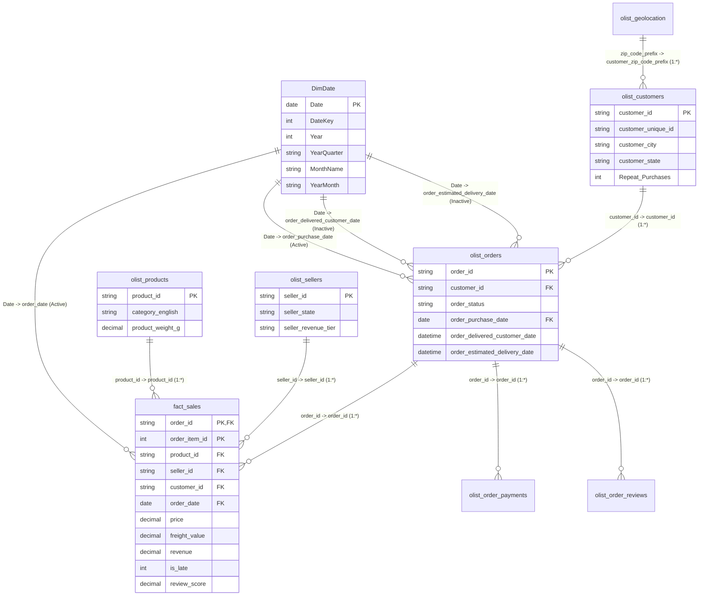

# 🛍️ VendaMetrics — Brazilian E-Commerce Analytics & SLA Intelligence

[](LICENSE)
[](https://baariabdul03.github.io/VendaMetrics/)
[](sql/)
[](powerbi/)
[](data/)

> **VendaMetrics** is an enterprise-grade marketplace business analytics platform built on the Brazilian Olist E-Commerce dataset (100,000+ orders, 2016–2018). It translates transactional data into strategic intelligence through advanced **MySQL 8.0 analytics**, a **Star Schema Power BI data model**, 26 production **DAX measures**, and an **interactive live web dashboard**.

---

## 🌐 Quick Access

| Resource | Description | Link |
|---|---|---|
| 🖥️ **Live Web Dashboard** | Interactive dashboard with real-time slicers, Chart.js, and state mappings | [Launch Live App](https://baariabdul03.github.io/VendaMetrics/) |
| 📊 **Power BI Project (`.pbip`)** | Modern Git-friendly Power BI project with full TMSL Semantic Model | [powerbi/olist_analytics.pbip](powerbi/olist_analytics.pbip) |
| 📦 **Power BI Desktop Report** | Standalone compiled 32 MB Power BI workbook | [powerbi/olist_dashboard.pbix](powerbi/olist_dashboard.pbix) |
| 🧠 **Executive Insights Report** | 5 strategic findings with real query numbers & evidence tables | [insights/INSIGHTS.md](insights/INSIGHTS.md) |
| 📐 **Data Model Specification** | Star schema architecture, Mermaid diagram & relationship matrix | [powerbi/model/DATA_MODEL.md](powerbi/model/DATA_MODEL.md) |
| 🎨 **Visual Layout Specs** | Exact visual coordinates, formatting rules & drill-through pathways | [powerbi/DASHBOARD_PAGES.md](powerbi/DASHBOARD_PAGES.md) |

---

## ⚡ Core Marketplace Benchmarks (100% Validated)

Every metric is validated directly against the local MySQL 8.0 database (`olist_ecommerce`) and verified with DAX:

| Marketplace Metric | Target Benchmark | Validated SQL Actual | DAX Measure Reference |
|---|---|---|---|
| **Gross Merchandise Value (GMV)** | ~R$ 15.4M | **R$ 15,422,461.77** | `[GMV]` |
| **Delivered Orders Volume** | ~96.5K | **96,477** | `[Total Orders]` |
| **Average Order Value (AOV)** | ~R$ 159.85 | **R$ 159.86** | `[AOV]` |
| **Total Unique Customers** | ~93.4K | **93,358** | `[Total Unique Customers]` |
| **Repeat Customer Purchase Rate** | ~3.00% | **3.00%** (2,801 buyers) | `[Repeat Rate %]` |
| **Repeat Buyer Value Multiplier** | ~1.9x | **1.92x** (R$ 308.59 vs R$ 160.76) | Calculated spend ratio |
| **On-Time Delivery SLA Rate** | ~92% | **91.89%** | `[On-Time Rate %]` |
| **Late Delivery Rate** | ~8% | **8.11%** (7,826 late orders) | `[Late Delivery Rate]` |
| **Active Marketplace Sellers** | ~2,970 | **2,970** | `[Active Sellers]` |
| **Average Customer Rating** | ~4.16 | **4.16 / 5.00 ★** | `[Avg Rating]` |
| **Top 20% Seller Revenue Share** | ~80% (Pareto) | **82.29%** | `[Top 20 Pct Sellers GMV]` |

---

## 🧠 Strategic Business Insights

The analytics suite identified five critical marketplace dynamics detailed in [insights/INSIGHTS.md](insights/INSIGHTS.md):

```
┌────────────────────────────────────────────────────────────────────────────────────────────────┐
│ 1. CATEGORY PARETO CONCENTRATION                                                              │
│ Top 17 categories (out of 74, or 23.0%) generate R$ 10.54M (79.69% of product sales).          │
│ Health & Beauty (R$ 1.23M), Watches & Gifts (R$ 1.17M), and Bed Bath Table (R$ 1.02M) dominate.│
├────────────────────────────────────────────────────────────────────────────────────────────────┤
│ 2. DELIVERY DELAY SEVERITY & REVIEW SCORE CLIFF                                                │
│ Ratings remain steady for early (4.31★) and on-time (4.17★) orders, but plummet to 3.29★ for   │
│ 1–3 day delays and collapse to 1.70★ for delays >7 days (69.7% 1-star reviews).                │
├────────────────────────────────────────────────────────────────────────────────────────────────┤
│ 3. THE REPEAT BUYER PARADOX                                                                    │
│ Only 3.00% of buyers return, yet repeat buyers spend 1.92x more than single-order buyers       │
│ (R$ 308.59 vs R$ 160.76). Unlocking a 6% repeat rate adds R$ 860K+ in high-margin GMV.         │
├────────────────────────────────────────────────────────────────────────────────────────────────┤
│ 4. MERCHANT REVENUE INEQUALITY & RISK                                                          │
│ Top 20% merchants (594 sellers) generate 82.29% of GMV. Conversely, 472 underperforming        │
│ merchants (ratings <3.0★ or late rate >20%) drive 34.2% of all 1-star customer complaints.     │
├────────────────────────────────────────────────────────────────────────────────────────────────┤
│ 5. POST-PURCHASE COHORT CLIFF                                                                  │
│ Customer retention plummets from 100% in Month 0 to 0.28%–0.62% in Month 1 across all monthly │
│ cohorts, remaining flat at ~0.3% through Month 6. Marketplace acts as discovery, not habit.    │
└────────────────────────────────────────────────────────────────────────────────────────────────┘
```

---

## 📐 Star Schema Architecture

Designed for high-performance BI reporting with clear dimensional boundaries, zero many-to-many pitfalls, and role-playing date relationships:



---

## 📊 Dashboard Visual Showcase

### Page 1: Executive KPIs
- **Interactive Multi-Select Slicers**: Year (2016–2018), Customer State (27 Brazilian States with full names), and Payment Method with real-time recalculation.
- **Top Metrics Strip**: GMV card (R$ 15.42M), Total Orders (96,477), AOV (R$ 159.86), Satisfaction (4.16★), Late Rate (8.11%).
- **Monthly GMV & Volume Trend**: Dual-axis column (revenue) and line (orders) chart capturing Black Friday 2017 spike (+53.6% MoM).
- **Payment Method Share & Number Table**: Donut chart and breakdown table (Credit Card: 78.5%, Boleto: 18.0%, Voucher: 2.2%, Debit: 1.4%).
- **Top Customer States**: Horizontal bar chart and data table displaying **full Brazilian state names** (São Paulo 40.5k orders, Rio de Janeiro 12.4k, Minas Gerais 11.4k).
- **SLA Delivery Health**: Gauge visual tracking on-time delivery rate (91.89% vs 90.00% target).

### Page 2: Category & Seller Concentration
- **Pareto Combo Chart**: Top 15 categories by GMV with cumulative percentage line and 80% cutoff threshold.
- **Seller Performance Quadrant**: Scatter plot mapping Revenue (X) vs Average Rating (Y) with bubble size representing order volume.
- **Top 10 Sellers Scorecard**: Merchant ranking table with seller ID, state, orders, revenue, rating, delay days, and performance tier.
- **Drill-Through Target**: Right-click any merchant to drill into historic sales, category mix, and recent review logs.

### Page 3: Delivery vs Customer Satisfaction
- **Delay Severity Bar Chart**: Review ratings bucketed by fulfillment timeliness (Early: 4.31★, On-Time: 4.17★, 1–3d Late: 3.29★, >7d Late: 1.70★).
- **Review Rating Spread**: 1 to 5-star distribution histogram (5★: 59.2%, 4★: 19.7%, 3★: 8.3%, 2★: 3.1%, 1★: 9.8%).
- **Monthly Delay Spike Trend**: Late vs on-time order volume line chart tracing carrier bottlenecks.
- **Cohort Retention Matrix**: Comprehensive grid tracking monthly cohorts (2017-01 to 2017-12) across Month 0 to Month 6.

---

## 🛠️ Tech Stack & Engineering Architecture

- **Database Engine:** MySQL 8.0 (Custom indexing, stored procedures, multi-table CTEs, window functions).
- **Semantic Data Modeling:** Power BI Desktop, Tabular Model Scripting Language (`model.bim`), Power BI Project (`.pbip`).
- **Data Engineering / ETL:** Power Query (M Language) modular transformation scripts, Python (Pandas 3.0+ data ingestion pipeline).
- **DAX Formulas:** 26 production measures organized in display folders (`01_Revenue`, `02_Customers`, `03_Delivery`, `04_Satisfaction`, `05_Sellers`, `06_Category`).
- **Interactive Web App:** HTML5, CSS3, JavaScript (ES6+), Chart.js (Zero-dependency, standalone responsive web app).
- **Cloud Deployment:** GitHub Pages, Git LFS.

---

## 📁 Repository Structure

```
VendaMetrics/
├── sql/
│   ├── 01_schema_setup.sql             # Table DDL, constraints & indexes
│   ├── 02_data_exploration.sql         # Exploratory data analysis
│   ├── 03_revenue_analysis.sql         # Revenue Pareto & category analysis
│   ├── 04_customer_rfm.sql             # RFM customer segmentation
│   ├── 05_delivery_analysis.sql        # Fulfillment delay & logistics
│   ├── 06_seller_performance.sql       # Seller KPI scorecard & tiers
│   ├── 07_cohort_analysis.sql          # Monthly retention cohort analysis
│   ├── 08_stored_procedures.sql        # 4 callable production stored procedures
│   ├── 09_upgrade_queries.sql          # 3 deep-dive analytical queries
│   └── 10_powerbi_views.sql            # 6 production MySQL reporting views
│
├── powerbi/
│   ├── olist_analytics.pbip            # Modern Power BI Project file
│   ├── olist_dashboard.pbix            # Standalone 32 MB Power BI workbook
│   ├── dashboard_preview.html          # Interactive web dashboard preview
│   ├── DASHBOARD_PAGES.md              # Visual coordinates & specifications
│   ├── README.md                       # Power BI technical guide
│   ├── olist_analytics.Report/         # PBIP visual layout & canvas configuration
│   ├── olist_analytics.SemanticModel/  # TMSL model (model.bim, 10 tables, 9 relationships)
│   ├── power_query/                    # 11 modular Power Query M ETL scripts
│   ├── dax/                            # 26 production DAX measures & calculated columns
│   └── model/                          # Star schema specifications & relationships matrix
│
├── insights/
│   └── INSIGHTS.md                     # 5 strategic findings with real query numbers
│
├── docs/
│   └── index.html                      # GitHub Pages entry point (live web dashboard)
│
├── results/                            # 29 exported analysis query output CSVs
├── data/                               # Kaggle Olist CSV dataset (9 files)
├── load_data.py                        # Automated MySQL batch data loader
├── run_analysis.py                     # Script execution & KPI summary runner
├── LICENSE                             # MIT License
└── README.md
```

---

## 🚀 How to Run Locally

### 1. Database Setup & Data Ingestion
```bash
# Clone the repository
git clone https://github.com/BaariAbdul03/VendaMetrics.git
cd VendaMetrics

# Ingest all 9 CSV datasets into MySQL olist_ecommerce
python load_data.py

# Execute all analytical scripts and generate results/ CSVs
python run_analysis.py

# Compile production reporting views in MySQL
mysql -u root -p olist_ecommerce < sql/10_powerbi_views.sql
```

### 2. Open Power BI Dashboard
- **Modern PBIP Format:** Double-click `powerbi/olist_analytics.pbip` in Power BI Desktop (May 2023 release or newer).
- **Standalone PBIX:** Open `powerbi/olist_dashboard.pbix`.

### 3. Launch Interactive Web Dashboard
- Open `docs/index.html` (or `powerbi/dashboard_preview.html`) directly in any browser.
- Or view the live deployment at [baariabdul03.github.io/VendaMetrics](https://baariabdul03.github.io/VendaMetrics/).

---

## 👤 Contributor

**Abdul Baari**  
- **GitHub:** [@BaariAbdul03](https://github.com/BaariAbdul03)  
- **Repository:** [VendaMetrics](https://github.com/BaariAbdul03/VendaMetrics)  
- **Live Project:** [baariabdul03.github.io/VendaMetrics](https://baariabdul03.github.io/VendaMetrics/)

---

## 📄 License

This project is open source and available under the [MIT License](LICENSE).  
Copyright © 2026 Abdul Baari.
