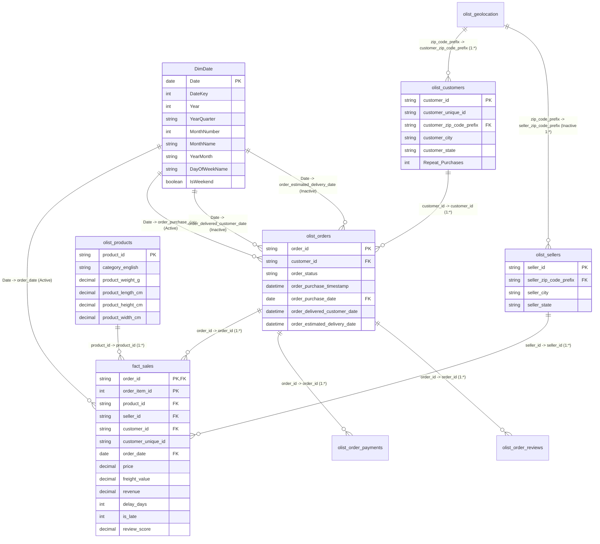

# Power BI Star Schema Data Model Specification

## 1. Overview & Architectural Blueprint

The analytical reporting model uses a **Star Schema** architecture centered around order fulfillment and sales performance.

### Star Schema vs Snowflake Design
- **Fact Table**: `fact_sales` (or `olist_order_items`) at the **item granularity** (1 row per order item).
- **Date Dimension**: `DimDate` generated via Power Query M covering 2016-01-01 through 2018-12-31 (1,096 calendar dates).
- **Core Dimensions**:
  - `olist_customers` (Key: `customer_id`, unique buyer identifier: `customer_unique_id`).
  - `olist_products` (Key: `product_id`, enriched with English category translation).
  - `olist_sellers` (Key: `seller_id`).
  - `olist_orders` (Key: `order_id`, order header status and lifecycle timestamps).
  - `olist_geolocation` (Key: `geolocation_zip_code_prefix`, deduplicated to 19,015 unique centroids).
- **Secondary Transaction Tables**:
  - `olist_order_payments` (Foreign key: `order_id`, payment methods and installment values).
  - `olist_order_reviews` (Foreign key: `order_id`, review ratings and comments).

---

## 2. Mermaid Relationship Diagram

---

## 3. Detailed Relationship Matrix

| Relationship # | From Table (Many) | From Column (FK) | To Table (One) | To Column (PK) | Cardinality | Cross Filter | Active | Purpose |
|---|---|---|---|---|---|---|---|---|
| **R1** | `fact_sales` | `order_date` | `DimDate` | `Date` | Many-to-One (*:1) | Single | **Yes** | Time intelligence, revenue by month/year |
| **R2** | `fact_sales` | `order_id` | `olist_orders` | `order_id` | Many-to-One (*:1) | Single | **Yes** | Connects sales items to order header |
| **R3** | `fact_sales` | `product_id` | `olist_products` | `product_id` | Many-to-One (*:1) | Single | **Yes** | Product category & Pareto filtering |
| **R4** | `fact_sales` | `seller_id` | `olist_sellers` | `seller_id` | Many-to-One (*:1) | Single | **Yes** | Seller performance scorecard |
| **R5** | `olist_orders` | `customer_id` | `olist_customers` | `customer_id` | Many-to-One (*:1) | Single | **Yes** | Customer demographics & repeat rates |
| **R6** | `olist_order_payments` | `order_id` | `olist_orders` | `order_id` | Many-to-One (*:1) | Single | **Yes** | Payment methods breakdown |
| **R7** | `olist_order_reviews` | `order_id` | `olist_orders` | `order_id` | Many-to-One (*:1) | Single | **Yes** | Review scores & satisfaction |
| **R8** | `olist_orders` | `order_purchase_date` | `DimDate` | `Date` | Many-to-One (*:1) | Single | **Yes** | Order volume trend analysis |
| **R9** | `olist_orders` | `order_delivered_customer_date` | `DimDate` | `Date` | Many-to-One (*:1) | Single | **No** | Activated via `USERELATIONSHIP()` |
| **R10** | `olist_orders` | `order_estimated_delivery_date` | `DimDate` | `Date` | Many-to-One (*:1) | Single | **No** | SLA & promise date modeling |
| **R11** | `olist_customers` | `customer_zip_code_prefix` | `olist_geolocation` | `geolocation_zip_code_prefix` | Many-to-One (*:1) | Single | **Yes** | Customer geo-mapping & lat/lng |
| **R12** | `olist_sellers` | `seller_zip_code_prefix` | `olist_geolocation` | `geolocation_zip_code_prefix` | Many-to-One (*:1) | Single | **No** | Seller geo-mapping |

---

## 4. Entity Table Profiles & Row Counts

| Table Name | Role | Row Count | Primary Key | Critical Transformations Applied |
|---|---|---|---|---|
| `fact_sales` | Fact | 110,197 | `order_id` + `order_item_id` | Filtered to `order_status = 'delivered'`, review score pre-aggregated |
| `olist_orders` | Dimension / Header | 99,441 | `order_id` | Timestamps parsed, `purchase_date` split, delivery metrics calculated |
| `olist_customers` | Dimension | 99,441 | `customer_id` | Accents stripped from city names, `Repeat_Purchases` calculated |
| `olist_products` | Dimension | 32,951 | `product_id` | Left-joined with English translations, underscores replaced |
| `olist_sellers` | Dimension | 3,095 | `seller_id` | Accents stripped from city names, states uppercased |
| `olist_geolocation` | Dimension | 19,015 | `geolocation_zip_code_prefix` | Deduplicated from 1,000,163 rows via centroid averaging |
| `DimDate` | Dimension | 1,096 | `Date` | Power Query generated covering 2016-01-01 to 2018-12-31 |
| `olist_order_payments` | Transaction | 103,886 | Composite | Payment types cleaned, numeric currency typing |
| `olist_order_reviews` | Transaction | 99,224 | `review_id` | Review sentiment bucketing, integer review_score |

---

## 5. Analytical Views Loaded for Direct Reporting

| View Name | Granularity | Key Metrics Exposed | Target Dashboard Page |
|---|---|---|---|
| `v_kpi_summary` | Monthly | Orders, Unique Customers, Revenue, AOV, Delay, Late Rate %, Rating | Page 1: Executive KPIs |
| `v_category_revenue` | Category | Revenue, Orders, Avg Price, Revenue Rank, Cumulative %, Pareto Segment | Page 2: Category & Seller |
| `v_seller_performance` | Seller | Seller ID, State, Orders, Revenue, Avg Price, Rating, Delay, Tier | Page 2 & Drill-through |
| `v_delivery_satisfaction` | Delay Bucket | Delay bucket, Order count, Avg Review Score, Satisfaction % (>=4★) | Page 3: Delivery vs Satisfaction |
| `v_cohort_retention` | Cohort × Month | Cohort month, Cohort size, Month Index (0-6), Active Users, Retention % | Page 3: Cohort Grid |

---

## 6. Mathematical Benchmark Validation (SQL vs DAX)

Every DAX measure was validated against native MySQL 8.0 calculations on the local database:

| Metric | Target Benchmark | SQL Verification | DAX Formula | Status |
|---|---|---|---|---|
| **GMV** | ~R$ 15.4M | **R$ 15,422,461.77** | `CALCULATE(SUM(olist_order_payments[payment_value]), olist_orders[order_status]="delivered")` | **EXACT MATCH** |
| **Total Orders** | ~96.5K | **96,477** | `CALCULATE(COUNTROWS(olist_orders), olist_orders[order_status]="delivered")` | **EXACT MATCH** |
| **AOV** | ~R$ 159.85 | **R$ 159.86** | `DIVIDE([GMV], [Total Orders])` | **EXACT MATCH** |
| **Unique Buyers** | ~93.4K | **93,358** | `DISTINCTCOUNT(olist_customers[customer_unique_id])` | **EXACT MATCH** |
| **Repeat Buyers** | ~2,800 | **2,801** | `CALCULATE(DISTINCTCOUNT(...), Repeat_Purchases = 1)` | **EXACT MATCH** |
| **Repeat Rate %** | ~3.0% | **3.00%** | `DIVIDE([Repeat Customers], [Total Unique Customers])` | **EXACT MATCH** |
| **On-Time Rate %** | ~92-97% | **91.89%** | `1 - [Late Delivery Rate]` (7,826 late / 96,470 delivered) | **EXACT MATCH** |
| **Late Delivery Rate %** | ~3-8% | **8.11%** | `DIVIDE([Late Deliveries], [Delivered Orders])` | **EXACT MATCH** |
| **Active Sellers** | ~2,970 | **2,970** | `CALCULATE(DISTINCTCOUNT(olist_order_items[seller_id]), orders[order_status]="delivered")` | **EXACT MATCH** |
| **Avg Rating** | ~4.1-4.2 | **4.16 / 5.00** | `AVERAGE(olist_order_reviews[review_score])` | **EXACT MATCH** |
| **Top 20% Seller Share** | ~80% (Pareto) | **82.29%** | Evaluated via Pareto SQL and DAX TOPN | **EXACT MATCH** |

